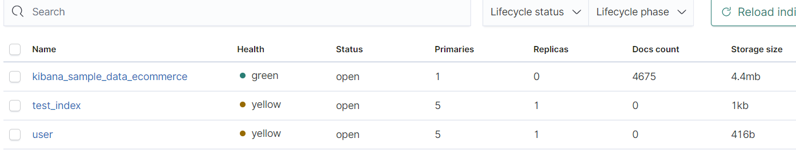

>`ElasticSearch和Kibana Version：7.8.0`

### 一.ElasticSearch介绍

#### 1.1 引言

>1.在海量数据中搜索想要的东西时，mysql执行效率太低
>
>2.如果关键字输入不正确，也能获取到正确的结果
>
>3.将搜索的关键字，在搜索结果中以高亮的方式显示

#### 1.2 ElasticSearch介绍

>ES是一个使用java语言开发基于Luence编写的分布式搜索引擎，提供了一个统一基于**Restful** 风格的web接口，官方也提供多种语言的API。
>
>Luence： 本身就是做全文搜索的`一个jar` 本身使用不太方便。学习成本比较高。
>
>分布式：主要是突出他的横向扩展能力（也就是集群）
>
>全文检索:jack_o_lantern:将一段文字进行分词，并且将分出来的单个词语统一的放到一个分词库中去，在搜索时，根据关键字去分词库中搜索，找到匹配的内容。（倒排索引）
>
>Restful风格接口：使得操作es非常简单（发送http请求）
>
>应用广泛：**github.com,wiki,stackoverflow**


#### 1.3 ES和Solr的区别

>1.solr在查询死数据时速度比较快，如果数据时实时变化的solr的查询速度很慢，ES基本上没有什么区别
>
>2.solr搭建集群需要借助第三方工具zookeeper，es本身就支持集群扩展，不需要第三方介入
>
>3.solr针对国内文档不是很多，ES社区很火爆，ES文档非常健全。
>
>4.ES对云计算（多租户）和大数据支持非常好

#### 1.4 倒排索引

> 在插入数据的时候，将存放的数据，以一定方式进行分词，并且将分词的内容存放到一个单独的分词库中。
>
> 当用户去查询的时候，会将用户查询的关键词进行分词。
>
> 然后去分词库中匹配内容，最终得到数据的id标识。
>
> 最后根据获取的id标识到存放的位置获取匹配的数据


### 二.ElasticSearch安装

#### 2.3 安装IK分词器 （对中文支持比较好）

>version :7.8.0 下载：https://github.com/medcl/elasticsearch-analysis-ik/releases/download/v7.8.0/elasticsearch-analysis-ik-7.8.0.zip

`如果使用es默认的分词器话，对中文的支持不太友好，会把每个字都分开`

>ik 分词器的使用 Analyzer: `ik_smart` , `ik_max_word`  Tokenizer: `ik_smart` , `ik_max_word`

```json
POST _analyze
{
  "analyzer": "ik_max_word",
  "text": "我是中国人"
}
结果：
{
  "tokens" : [
    {
      "token" : "我",
      "start_offset" : 0,
      "end_offset" : 1,
      "type" : "CN_CHAR",
      "position" : 0
    },
    {
      "token" : "是",
      "start_offset" : 1,
      "end_offset" : 2,
      "type" : "CN_CHAR",
      "position" : 1
    },
    {
      "token" : "中国人",
      "start_offset" : 2,
      "end_offset" : 5,
      "type" : "CN_WORD",
      "position" : 2
    },
    {
      "token" : "中国",
      "start_offset" : 2,
      "end_offset" : 4,
      "type" : "CN_WORD",
      "position" : 3
    },
    {
      "token" : "国人",
      "start_offset" : 3,
      "end_offset" : 5,
      "type" : "CN_WORD",
      "position" : 4
    }
  ]
}
```


### 三.ElasticSearch基本操作

#### 3.1 ES结构

##### 3.1.1 索引index

> ES服务中可以创建多个索引，每一个索引默认被分成5片存储
>
> 每个分片都会存在至少一个备份分片
>
> 备份分片默认不会帮助检索数据，当ES压力特别大的时候，备份才会帮助检索数据
>
> 集群中备份的分片必须放在不同的服务器中。`如果没有集群的话，服务器中一个索引被默认分成5个主分片，没有备分分片存在`
>

##### 3.1.2 Type

> 一个type 相当于mysql table

`5.X 版本中可以有多个type`

`6.x中只有个type`

`7.x中没有type`

##### 3.1.3 Document


##### 3.1.4 Field

#### 3.2 操作ES的Restful语法

>`GET` 请求: （**查询**）
>
>http://ip:port/index //查询索引信息
>
>http://ip:port/index/type/doc_id //查询文档信息 
>
>http://ip:port/index/_search  
>
>`POST` 请求 （**查询和修改**）
>
>http://ip:port/index/type/_search //查询文档，在请求体中添加json 字符串的方式来代表查询条件
>
>http://ip:port/index/type/doc_id/_update //修改某个文档，在请求体中通过json字符串来代表修改条件
>
>`PUT`请求(**Created**)
>
>http://ip:port/index  //创建一个索引 需要在请求体中指定索引信息（索引类型，结构属性信息）
>
>http://ip:port/index/type/_mappings  // 代表创建索引时， 指定索引文档的存储的属性信息
>
>`DELETE` 请求
>
>http://ip:port/index //删除索引
>
>http://ip:port/index/type/doc_id //删除指定文档

#### 3.3 索引的操作

##### 3.3.1 创建一个索引 

```json
#创建一个索引(无结构信息)
PUT /user
{
  "settings": {
    "number_of_shards": 5, 
    "number_of_replicas": 1
  }
}
#创建一个完整的索引
PUT /book
{
 "settings": {
   "number_of_shards": 5,#主分片数
   "number_of_replicas": 1 #副分片数
 } ,
 "mappings": {#映射
   "properties": {
      "name":{#field
        "type": "text",
        "analyzer": "ik_max_word",#设置分词器
        "index": true,#默认为true，指定当前field是否可以被当作查询条件
        "store": false#默认位false，是否需要额外存储
      },
      "price":{
        "type": "double"
      },
      "author":{
        "type": "keyword"
      },
      "onSaleTime":{
        "type": "date",
        "format": "yyyy-MM-dd HH:mm:ss||epoch_millis||yyyy-MM-dd"
      },
      "description":{
        "type": "text"
      }
   }
 }
}

```

`说明：索引user health 是yellow状态，那是因为我本地是单机版，而单机版只有主分片，没有备份分片存在，需要集群ES才能自动将备份分片放到集群其他机器上去(避免主分片数据丢失)，health就会变成green`



##### 3.3.2 查看索引信息

```json
#查看某个索引信息
GET /user

response:
{
  "user" : {
    "aliases" : { },
    "mappings" : { },
    "settings" : {
      "index" : {
        "creation_date" : "1600790372917",
        "number_of_shards" : "5",
        "number_of_replicas" : "1",
        "uuid" : "kKkKqQBITiyZuZBrs7kq8w",
        "version" : {
          "created" : "7080099"
        },
        "provided_name" : "user"
      }
    }
  }
}
```

##### 3.3.3 删除索引

```json
#删除索引
DELETE /test_index
response:
{
  "acknowledged" : true
}
```

##### 3.3.4 ES文档中Field属性的类型

>* **普通类型**
>
>  + 二进制 一个Base64的字符串
>
>  + boolean 
>
>  + Keywords  分为`keyword` `constant_keyword` `wildcard`   一般不会被分词
>
>  + Number `long` `integer` `short` `byte` `double` `float`  `half_float` `scaled_float` 
>
>  + Dates `date` `date_nanos`
>    格式有`"date": "2015-01-01"`  `"date": "2015-01-01T12:10:30Z"` `"date": 1420070400001` 三种格式
>
>    ```json
>    {
>      "mappings": {
>        "properties": {
>          "date": {
>            "type":   "date",
>            "format": "yyyy-MM-dd HH:mm:ss||yyyy-MM-dd||epoch_millis"
>          }
>        }
>      }
>    }
>    ```
>
>  + alias 别名
>
>* **对象和关系类型**
>  1. `object ` 一个json对象
>  2. `flattened` 将整个json对象作为一个field的value
>  3. `nested` 一个JSON对象，它保留子字段之间的关系。
>  4. `join` 定义同一索引中文档的父/子关系。
>* **结构数据类型**
>* **聚合数据类型**
>* **文本搜索类型**
>  + `text `  分析  非结构化文本，会被分词
>  + `annotated-text` 带批注的文本
>  + `completion` 
>  + `search_as_your_type` 
>  + `token_count `文本标记次数
>* **文档排名类型**
>* **空间数据类型**
>* 其他类型

##### 3.3.5 kibana 操作创建索引

>+ 通过`put`方式并且需要指定id 进行创建文档
>
>

#### 3.4 文档操作

##### 3.4.1 创建文档

>+ 通过`put`方式并且需要指定id 进行创建文档 
>  `PUT /book/_doc/1`
>
>+ 通过`POST` 方式可以指定id来创建文档，也可以不用指定（es自动生成唯一id）
>
> ​     `POST /book/_doc/1` or `POST /book/_doc/`   两种方式都可以使用
>
>

##### 3.4.2 修改文档

##### 3.4.3 删除文档

##### 3.4.4 查询文档

### 四.Java操作ElasticSearch

### 五.ElasticSearch练习

### 六.ElasticSearch各种查询


